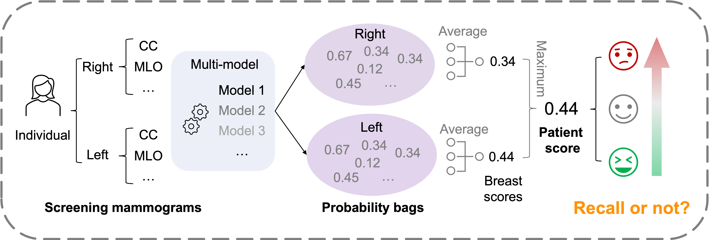

# 1st-place-solution of [SPR Screening Mammography Recall](https://www.kaggle.com/c/spr-screening-mammography-recall/overview)

Differentiate between negative (**BI-RADS 1,2**) and positive (**BI-RADS 0,3,4,5**) recall mammograms.

## Our pipeline



> ### [Our competition rank ](https://www.kaggle.com/competitions/spr-screening-mammography-recall/leaderboard)
>
>[](https://www.kaggle.com/competitions/spr-screening-mammography-recall/leaderboard)

---
## Overview

>### List of contents
>- [Data Processing Steps](#data-processing-steps)
>- [Model Training](#model-training)
>- [Prepare the test submission](#prepare-the-test-submission)
>- [Evaluation Results](#evaluation-results)
>- [TODO](#todo)
>- [License](#license)
>- [Acknowledgements](#acknowledgements)

---
### Data Processing

<details>
    <summary style="font-size:13px; color:#0b0b0b;"> <b> Step 1: Data Download and Unzip </b> </summary>

[//]: # (#### Step 1: Data Download and Unzip)
- Download the data from the [Kaggle competition page](https://www.kaggle.com/c/spr-screening-mammography-recall/data).
- Unzip the data into a directory.
```bash
cd /Your/Data/Path
for i in {1..9}; do
    curl -L -o ./Kaggle_SPR_Screening_Mammography/spr-mmg-$i.zip \
        https://www.kaggle.com/api/v1/datasets/download/felipekitamura/spr-mmg-$i
        
    unzip ./Kaggle_SPR_Screening_Mammographyspr-mmg-$i.zip -d ./Kaggle_SPR_Screening_Mammography/dicoms/
done

curl -L -o ./Kaggle_SPR_Screening_Mammography/spr-mmg-02.zip \
        https://www.kaggle.com/api/v1/datasets/download/felipekitamura/spr-mmg-02
        
unzip ./Kaggle_SPR_Screening_Mammographyspr-mmg-02.zip -d ./Kaggle_SPR_Screening_Mammography/dicoms/
```

</details>

<details>
    <summary style="font-size:13px; color:#0b0b0b;"> <b> Step 2: Data Preprocessing </b> </summary>

[//]: # (#### Step 2: Data Preprocessing)
- The data is in DICOM format. I will use the `pydicom` library to read the DICOM files and convert them to PNG format.
```bash
cd /Your/Codebase/Path/Kaggle_SPR
# Two kinds of processed data are provided: raw PNG and cropped+resized PNG into the "raw_png" folder and the "processed_png" folder.
# The raw PNG is converted from the original DICOM files directly.
# The cropped+resized PNG is converted from the original DICOM files after cropping the breast area and resizing to 2048 \times 1024. 

python ./Image_preprocess/data_preprocess.py \
    --src_folder /Your/Data/Path/Kaggle_SPR_Screening_Mammography/dicoms/ \
    --dest_folder /Your/Data/Path/Kaggle_SPR_Screening_Mammography/pngs/ \
```
</details>

<details>
    <summary style="font-size:13px; color:#0b0b0b;"> <b> Step 3: Metadata collection from DICOM tags </b> </summary>

[//]: # (#### Step 3: Metadata collection from DICOM tags)
- The metadata is collected from the DICOM tags.
```bash
python ./Image_preprocess/dcmtags_collection.py \
    --src_folder /Your/Data/Path/Kaggle_SPR_Screening_Mammography/dicoms/ \
    --dest_folder /Your/Data/Path/Kaggle_SPR_Screening_Mammography/pngs/ \
```
</details>

<details>
    <summary style="font-size:13px; color:#0b0b0b;"> <b> Step 4: Data Splitting </b> </summary>

[//]: # (#### Step 4: Data Splitting)
- The data is split into training and validation sets. The split is done on the patient level.
```bash
python ./Image_preprocess/cv_split.py
```
</details>

---
### Model Training
The model is trained using the training set and validated using the validation set. The model is trained using the `train.py` script.

<details>
    <summary style="font-size:13px; color:#0b0b0b;"> <b> EfficientNet-B2 & B5 Backbone with public weights（Mammo-CLIP) </b> </summary>

```bash
cd /Your/Codebase/Path/Kaggle_SPR/mammo_cls

BS=12
ImgSize=1536 # 256 512 1024 1536 2048
for arch in efficientnet_b2 efficientnet_b5
do
  base_model_path="/Your/Codebase/Path/Mammo-CLIP/weights/$arch"
  csv_dir="/Your/Codebase/Path/Kaggle_SPR/data_csv/cv_split"  # change to your own directory
  results_dir="/Your/Codebase/Path/Kaggle_SPR/finetune_${ImgSize}/"  # change to your own directory
  image_dir="/Your/Image/Path"  # change to your own directory
  dataset_config="/Your/Codebase/Path/Kaggle_SPR/configs/datasets/datasets.yaml" # change to your own dataset config

  pretrained_model_path="${base_model_path}.tar"

  for fold in 0 1 2 3
  do

    echo "${arch} fold--$fold"
    python train.py \
    --seed 42 \
    --fold $fold \
    --num-output-neurons 1 \
    --pretrained_model_path $pretrained_model_path \
    --model_method Mammo_Clip \
    --dataset spr \
    --dataset-config $dataset_config \
    --csv-dir $csv_dir \
    --image-dir $image_dir \
    --accumulation_steps 32 \
    --batch-size $BS \
    --img-size $ImgSize \
    --results-dir $results_dir \
    
  done
done
```
</details>

<details>
    <summary style="font-size:13px; color:#0b0b0b;"> <b> ResNet-18 Backbone with public weights（MIRAI）</b> </summary>

```bash
cd /Your/Codebase/Path/Kaggle_SPR/mammo_cls

BS=12
ImgSize=2048 # 256 512 1024 1536 2048
for arch in resnet18
do
  base_model_path="/Your/Codebase/Path/Mammo-CLIP/weights/$arch"
  csv_dir="/Your/Codebase/Path/Kaggle_SPR/data_csv/cv_split"  # change to your own directory
  results_dir="/Your/Codebase/Path/Kaggle_SPR/finetune_${ImgSize}/"  # change to your own directory
  image_dir="/Your/Image/Path"  # change to your own directory
  dataset_config="/Your/Codebase/Path/Kaggle_SPR/configs/datasets/datasets.yaml" # change to your own dataset config

  pretrained_model_path="${base_model_path}.tar"

  for fold in 0 1 2 3
  do

    echo "${arch} fold--$fold"
    python train.py \
    --seed 42 \
    --fold $fold \
    --num-output-neurons 1 \
    --pretrained_model_path $pretrained_model_path \
    --model_method MIRAI \
    --dataset spr \
    --dataset-config $dataset_config \
    --csv-dir $csv_dir \
    --image-dir $image_dir \
    --accumulation_steps 32 \
    --batch-size $BS \
    --img-size $ImgSize \
    --results-dir $results_dir \
    
  done
done
```
</details>

<details>
    <summary style="font-size:13px; color:#0b0b0b;"> <b> ConvNeXt-Small Backbone with public weights（RSNA-2023-Mammo[1st]）</b> </summary>

```bash
cd /Your/Codebase/Path/Kaggle_SPR/mammo_cls

BS=12
ImgSize=2048 # 256 512 1024 1536 2048
for arch in resnet18
do
  base_model_path="/Your/Codebase/Path/Mammo-CLIP/weights/$arch"
  csv_dir="/Your/Codebase/Path/Kaggle_SPR/data_csv/cv_split"  # change to your own directory
  results_dir="/Your/Codebase/Path/Kaggle_SPR/finetune_${ImgSize}/"  # change to your own directory
  image_dir="/Your/Image/Path"  # change to your own directory
  dataset_config="/Your/Codebase/Path/Kaggle_SPR/configs/datasets/datasets.yaml" # change to your own dataset config

  pretrained_model_path="${base_model_path}.tar"

  for fold in 0 1 2 3
  do

    echo "${arch} fold--$fold"
    python train.py \
    --seed 42 \
    --fold $fold \
    --num-output-neurons 1 \
    --pretrained_model_path $pretrained_model_path \
    --model_method MIRAI \
    --dataset spr \
    --dataset-config $dataset_config \
    --csv-dir $csv_dir \
    --image-dir $image_dir \
    --accumulation_steps 32 \
    --batch-size $BS \
    --img-size $ImgSize \
    --results-dir $results_dir \
    
  done
done
```
</details>

---
### Prepare the test submission
<details>
    <summary style="font-size:13px; color:#0b0b0b;"> <b> Ready for Submission CSV </b> </summary>

```bash
python ./result_analysis/result_analysis_test.py
```
</details>

---
## Evaluation Results
### What works
- Ensemble model. Make sure each fold-based model is involved in the ensemble model, even if no models in the same fold are good (not very sure).
- Large size of the image sometimes works better.
- Advancement of the backbone model. For example, EfficientNet-B2/B5 and ConvNext-Small are better than ResNet18. May be due to the more parameters and optimized architectural design.
- I changed the averaging probs to maximum prob when calculating the patient-level scores from breast-level scores, AUC ups from 0.783 to 0.793!

### What doesn't work
- Aux-task learning is not working well. The model may be overfitting on the CV.
- More external training datasets are not working well. Maybe I failed to set the label correctly.

<details>
    <summary style="font-size:13px; color:#0b0b0b;"> <b> Click to expand for details </b> </summary>

| Backbone with public weights                                                                                                   | Img-Size    | Training Dataset          | Fold 0 | Fold 1 | Fold 2 | Fold 3 | Public LB                                      | Private LB                                |
|--------------------------------------------------------------------------------------------------------------------------------|-------------|---------------------------|--------|--------|--------|--------|------------------------------------------------|-------------------------------------------|
| **_Mammo-CLIP pretrained method_**                                                                                             |
| [1] EfficientNet-B2 (Mammo-CLIP)                                                                                               | `1536×768`  | SPR                       | 0.785  | 0.766  | 0.781  | 0.769  | 0.772                                          | -                                         |
| [2] EfficientNet-B5 (Mammo-CLIP)                                                                                               | `1536×768`  | SPR                       | 0.776  | 0.774  | 0.780  | 0.781  | 0.773                                          | -                                         |
| <span style="color:red;">**Ensemble model [1, 2]**</span>                                                                      | `1536×768`  | SPR                       | -      | -      | -      | -      | <span style="color:red;">**0.775**</span>      | -                                         |
| **_MIRAI pretrained method_**                                                                                                  |
| [3] ResNet18 (MIRAI)                                                                                                           | `1536×768`  | SPR                       | 0.773  | 0.768  | 0.775  | 0.762  | 0.762                                          | -                                         |
| <span style="color:red;">**Ensemble model [1, 2, 3]**</span>                                                                   | `1536×768`  | SPR                       | -      | -      | -      | -      | <span style="color:red;">**0.777**</span>      | -                                         |
| RSNA2023Mammo pretrained method                                                                                                |
| [4] ConvNext-Small (RSNA2023Mammo)                                                                                             | `1536×768`  | SPR                       | 0.784  | 0.771  | 0.770  | 0.770  | 0.771                                          | -                                         |
| <span style="color:red;">**Ensemble model [1, 2, 3, 4]** </span>                                                               | `1536×768`  | SPR                       | -      | -      | -      | -      | <span style="color:red;">**0.780**</span>      | _                                         |
| **_Aux-task method_**                                                                                                          |
| ~~[5] ResNet18 (MIRAI)  Aux-task [age]~~                                                                                       | `1536×768`  | SPR                       | 0.775  | 0.764  | 0.774  | 0.770  | TODO                                           | -                                         |
| ~~<span style="color:blue;">**Ensemble model [1, 2, 3, 4, 5]**</span>~~                                                        | `1536×768`  | SPR                       | -      | -      | -      | -      | ~~<span style="color:blue;">0.776</span>~~     | -                                         |
| ~~<span style="color:blue;">**Ensemble model [1, 2, 4, 5]**</span>~~                                                           | `1536×768`  | SPR                       | -      | -      | -      | -      | ~~<span style="color:blue;">0.778</span>~~     | -                                         |
| ~~[6] EfficientNet-B2 (Mammo-CLIP) Aux-task [age]~~                                                                            | `1536×768`  | SPR                       | 0.785  | 0.771  | 0.773  | 0.778  | 0.766                                          | -                                         |
| ~~[7] EfficientNet-B5 (Mammo-CLIP) Aux-task [age]~~                                                                            | `1536×768`  | SPR                       | 0.785  | -      | -      | -      | TODO                                           | -                                         |
| **_Large size of image_**                                                                                                      |
| [8] ConvNext-Small (RSNA2023Mammo)                                                                                             | `2048×1024` | SPR                       | 0.791  | 0.771  | 0.784  | 0.782  | <span style="color:red;">**0.782`(0)`**</span> | -                                         |
| ~~<span style="color:blue;">**Ensemble model [1, 2, 3, 4, 6`(012)`, 7, 8]**</span>~~                                           | `Mixed`     | SPR                       | -      | -      | -      | -      | ~~<span style="color:blue;">0.779</span>~~     | -                                         |
| ~~<span style="color:blue;">**Ensemble model [1, 2, 3, 4, 6`(01)`, 7, 8]**</span>~~                                            | `Mixed`     | SPR                       | -      | -      | -      | -      | ~~<span style="color:blue;">0.779</span>~~     | -                                         |
| <span style="color:red;">**Ensemble model [1, 2, 3, 4, 8]**</span>                                                             | `Mixed`     | SPR                       | -      | -      | -      | -      | <span style="color:red;">**0.782**</span>      | -                                         |
| <span style="color:red;">**Ensemble model [1, 2, 3, 4, 8] [max breast score]** </span>                                         | `Mixed`     | SPR                       | -      | -      | -      | -      | <span style="color:red;">**0.789**</span>      | _                                         |
| <span style="color:red;">**Ensemble all (> 0.78) in model [1`(02)`, 2`(23)`, 4`(0)`, 8`(0)`]** </span>                         | `Mixed`     | SPR                       | -      | -      | -      | -      | <span style="color:red;">**0.783**</span>      | _                                         |
| <span style="color:red;">**Ensemble all (> 0.78) in model [1`(02)`, 2`(23)`, 4`(0)`, 8`(0)`] [max breast score]** </span>      | `Mixed`     | SPR                       | -      | -      | -      | -      | <span style="color:red;">**0.787**</span>      | _                                         |
| ~~<span style="color:blue;">**Ensemble all (> 0.785) in model [1`(0)`,  8`(0)`]** </span>~~                                    | `Mixed`     | SPR                       | -      | -      | -      | -      | ~~<span style="color:blue;">**0.770**</span>~~ | -                                         |
| <span style="color:red;">**Ensemble top1 model in each fold [1`(2)`, 2`(13)`, 8`(0)`]** </span>                                | `Mixed`     | SPR                       | -      | -      | -      | -      | <span style="color:red;">**0.783**</span>      | _                                         |
| <span style="color:purple;">**Ensemble top1 model in each fold [1`(2)`, 2`(13)`, 8`(0)`] [max breast score]** </span>          | `Mixed`     | SPR                       | -      | -      | -      | -      | <span style="color:purple;">**0.793**</span>   | _                                         |
| <span style="color:red;">**Ensemble top2 models in each fold [1`(02)`, 2`(123)`, 4`(3)`, 8`(01)`]** </span>                    | `Mixed`     | SPR                       | -      | -      | -      | -      | <span style="color:red;">**0.783**</span>      | -                                         |
| <span style="color:red;">**Ensemble top2 models in each fold [1`(02)`, 2`(123)`, 4`(3)`, 8`(01)`] [max breast score]** </span> | `Mixed`     | SPR                       | -      | -      | -      | -      | <span style="color:red;">**0.790**</span>      | _                                         |
| <span style="color:red;">**Ensemble top1 models in each fold [1`(2)`, 2`(1)`, 8`(03)`] [max breast score]** </span>            | `Mixed`     | SPR                       | -      | -      | -      | -      | <span style="color:red;">**0.795**</span>      | <span style="color:red;">**0.838**</span> |
| **_More external training dataset_**                                                                                           |
| [3a] ResNet18 (MIRAI)                                                                                                          | `1536×768`  | SPR Vindr                 | 0.776  | -      | -      | -      | -                                              | -                                         |
| ~~[3b] ResNet18 (MIRAI)~~                                                                                                      | `1536×768`  | SPR CSAW                  | 0.757  | -      | -      | -      | -                                              | -                                         |
| ~~[3c] ResNet18 (MIRAI)~~                                                                                                      | `1536×768`  | SPR EMBED                 | 0.715  | -      | -      | -      | -                                              | -                                         |
| ~~[3d] ResNet18 (MIRAI)~~                                                                                                      | `1536×768`  | SPR Vindr RSNA            | 0.752  | -      | -      | -      | -                                              | -                                         |
| ~~[3e] EfficientNet-B2 (Mammo-CLIP)~~                                                                                          | `1536×768`  | SPR Vindr RSNA EMBED CSAW | 0.769  | -      | -      | -      | -                                              | -                                         |

</details>

---
## TODO
<details>
    <summary style="font-size:13px; color:#0b0b0b;"> <b> Click to Expand </b> </summary>


- [X] Check the data split, and especially make sure that the test set is independent.
- [X] Code ready to get test set predictions for Kaggle submission.
- [X] Add more public data for training.
  - [X] **VinDr**
  - [X] **RSNA**
  - [X] **EMBED**
  - [X] **CSAW-CC**

- [X] Support more backbone model training.
  - [X] Mammo-CLIP pretrained EfficientNet-B2 and EfficientNet-B5.
  - [X] MIRAI pretrained ResNet18.
  - [X] RSNA challenge pretrained Convnext.
  
- [X] Support auxiliary tasks learning. For example:
  - [X] Age estimation.
  - [X] BIRADS classification:
  - [X] Breast density classification.

</details>

---
## License
The code is Apache-2.0 licensed, as found in the [LICENSE file](LICENSE)

---
## Acknowledgements
- [Kaggle SPR Screening Mammography Recall](https://www.kaggle.com/c/spr-screening-mammography-recall/overview)
- [RSNA Screening Mammography Breast Cancer Detection](https://www.kaggle.com/competitions/rsna-breast-cancer-detection)
- [Github: Mammo-Clip](https://github.com/batmanlab/Mammo-CLIP)
- [Github: kaggle_rsna_breast_cancer](https://github.com/dangnh0611/kaggle_rsna_breast_cancer)
- [Github: Mirai](https://github.com/yala/Mirai)


